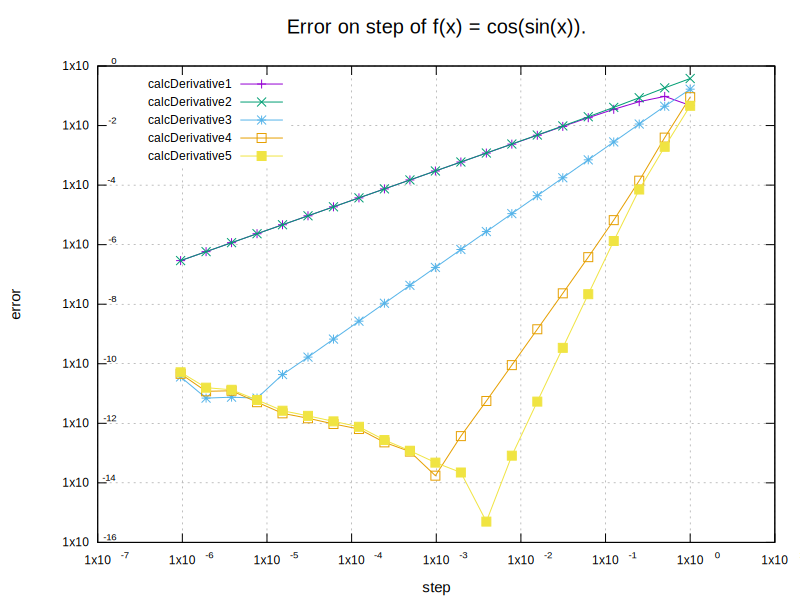
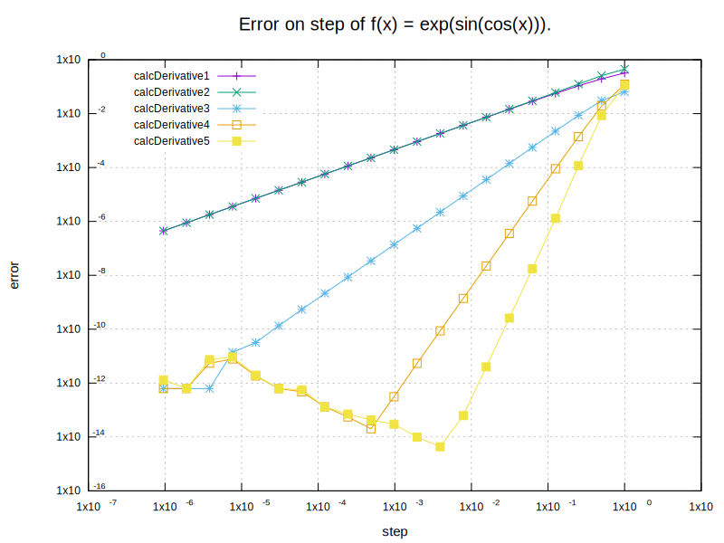
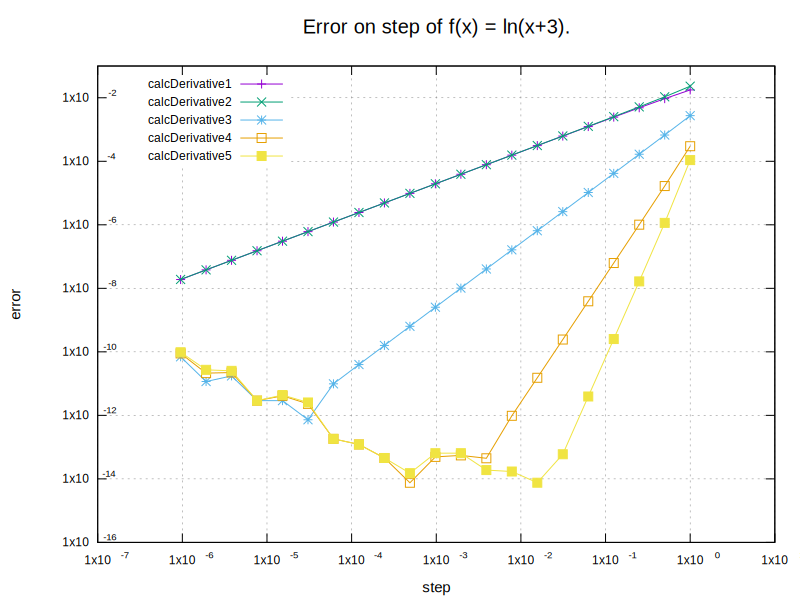

# Math Lab 1. Approximation of the first derivative
### Task
The task is to calculate an error on step of 5 approximation methods for 5 given functions.

### Result
##### 1. f(x) = sin(x^2)


##### 2. f(x) = cos(sin(x))


##### 3. f(x) = exp(sin(cos(x)))


##### 4. f(x) = ln(x+3)


##### 5. f(x) = sqrt(x+3)


### Conclusion
As we can see from plots, better approximation accuracy can be achieved by taking a smaller step. But this does not work in the whole range. There must be non-zero step at which maximum accuracy is achieved. Further step decreasing would lead to worse accuracy in calculations due to an error of [machine floating-point numbers](https://en.wikipedia.org/wiki/Floating-point_arithmetic).  

## Prerequisites
- C++20 capable compiler
- gnuplot utility

## Installation
- Clone the repository:
```sh
git clone https://github.com/NikitaDzer/computational-math.git
```
- Compile the project:
```sh
cd computational-math/Lab1\ -\ Approximation\ of\ derivative/
cmake -S . -B build
make -C build -j4
```

## Running
- Generate plots into `assets/` directory:
```sh
./build/lab1
```

---
♥ WITH LOVE
