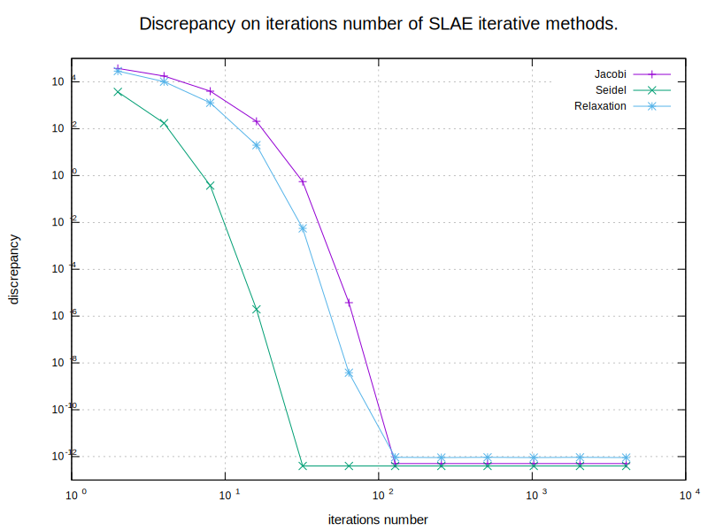

# Math Lab 2. Direct and iterative methods for solving SLAE
### Task
The task is to get acquainted with the methods for solving SLAE. There are 2 parts of the task:
* calculate discrepancy of [Gauss](https://en.wikipedia.org/wiki/Gaussian_elimination) and [LU-decomposition](https://en.wikipedia.org/wiki/LU_decomposition) methods
* calculate discrepancy on iterations number of [Jacobi](https://en.wikipedia.org/wiki/Jacobi_method), [Seidel](https://en.wikipedia.org/wiki/Gauss%E2%80%93Seidel_method) and [Relaxation](https://en.wikipedia.org/wiki/Successive_over-relaxation) iterative methods

### Results
#### 1. Gauss and LU-decomposition methods.
For a given matrix the discrepancy of two methods is ~0.

#### 2. Iterative methods.


### Conclusion
As we can see from a plot, the discrepancy of iterative methods decreases as the number of iterations increases. In fact, this is not done for every matrix, since not all matrices satisfy the condition of [convergence of iterative methods](https://en.wikipedia.org/wiki/Iterative_method).
Gauss and LU-decomposition methods are direct methods for solving SLAE, so their discrepancy, as expected, is ~0. 

## Prerequisites

- C++20 capable compiler
- gnuplot utility


## Installation
- Clone the repository:
```sh
git clone https://github.com/NikitaDzer/computational-math.git
```
- Compile the project:
```sh
cd computational-math/Lab2\ -\ Solving\ SLAE/
cmake -S . -B build
make -C build -j4
```

## Running
- Generate a plot and print the direct methods discrepancy:
```sh
./build/lab2
```
---
♥ WITH LOVE
