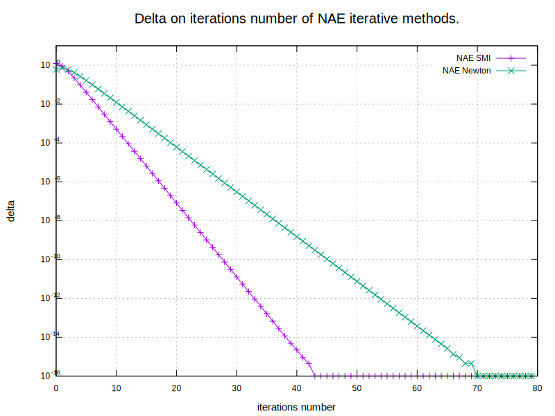
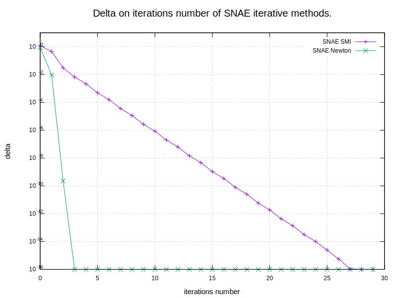

# Math Lab 3. Newton's and iterative methods for solving SNAE
### Task
The task is consist of 2 parts:
* get acquainted with the methods for [solving SNAE (lecture 4)](http://books.mipt.ru/book/301568/vychislitelnaja-matematika-kurs-lektsij.pdf?h=)
* find roots with the given accuracy 

##### NAE
2 * x^2 - 5 * x - 3 = 0;

##### SNAE
sin(x) - y = 1.32; <br>
cos(y) - x = -0.85;

### Results
##### NAE


##### SNAE


### Conclusion
As we can see from plots, SMI and Newton's methods numerically converge for the given NAE and SNAE. Also graphs are logarithmic, which corresponds to the [contraction mapping](https://en.wikipedia.org/wiki/Contraction_mapping).

## Prerequisites
- C++20 capable compiler

## Installation
- Clone the repository:
```sh
git clone https://github.com/NikitaDzer/computational-math.git
```
- Compile the project:
```sh
cd computational-math/Lab3\ -\ Solving\ SNAE/
cmake -S . -B build
make -C build -j4
```

## Running
- Generate plots and print roots of the given NAE and SNAE:
```sh
./build/lab3
```
---
♥ WITH LOVE
