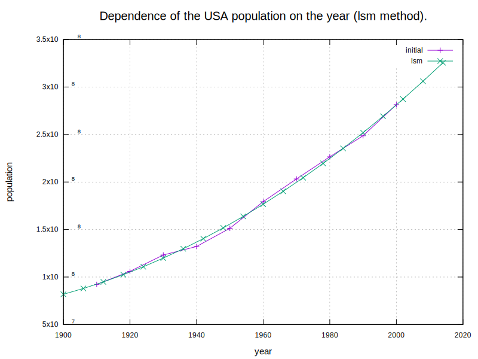
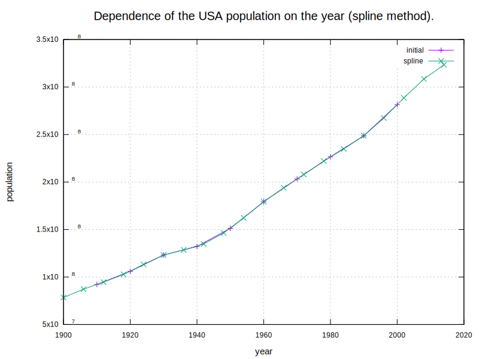
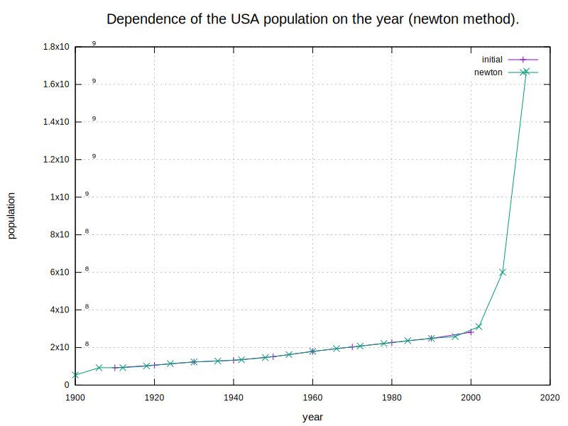

# Math Lab 4. Interpolation
### Task
The task is to interpolate US population using 3 methods:
* [least squares](https://en.wikipedia.org/wiki/Least_squares)
* [cubic spline](https://en.wikiversity.org/wiki/Cubic_Spline_Interpolation)
* [Newton polynomial](https://en.wikipedia.org/wiki/Newton_polynomial)

### Results
#### Least squares (quadratic polynomial)


#### Cubic spline


#### Newton polynomial


### Conclusion
As we can see from plots, the least square and spline methods fit well on the initial curve and do not have spikes. <br>
A Newton polynomial of this order (order = 9) is not suitable to extrapolate any data. <br>
US population in 2010:
* least squares: 312 mln
* cubic spline: 314 mln
* Newton polynomial: 828 mln
* real population: 309 mln

## Prerequisites

- C++20 capable compiler
- gnuplot utility


## Installation
- Clone the repository:
```sh
git clone https://github.com/NikitaDzer/computational-math.git
```
- Compile the project:
```sh
cd computational-math/Lab4\ -\ Interpolation/
cmake -S . -B build
make -C build -j4
```

## Running
- Generate plots and print extrapolated US population in 2010:
```sh
./build/lab4
```
---
♥ WITH LOVE
