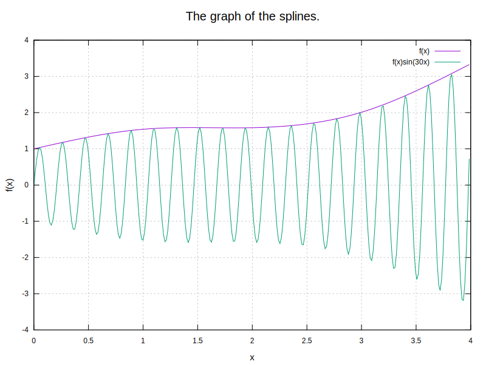

# Math Lab 5. Numerical integration
### Task
The task is to numerically integrate a tabulated function and a fast oscillating function using the [trapezoid method](https://en.wikipedia.org/wiki/Trapezoidal_rule).

### Results
#### Interpolated f(x) and f(x)sin(kx)


### Conclusion
As we can see from the plot, to correctly calculate the integral, a small step is needed (<0.01). 
Calculated integrals:
* VII 9.5a:  1.60314 (step = 0.25)
* VII 9.13d: 7.3074e-10 (step = 1.0e-10)


## Prerequisites

- C++20 capable compiler
- gnuplot utility


## Installation
- Clone the repository:
```sh
git clone https://github.com/NikitaDzer/computational-math.git
```
- Compile the project:
```sh
cd computational-math/Lab5\ -\ Numerical\ integration/
cmake -S . -B build
make -C build -j4
```

## Running
- Generate plots and print calculated integrals:
```sh
./build/lab5
```
---
♥ WITH LOVE
